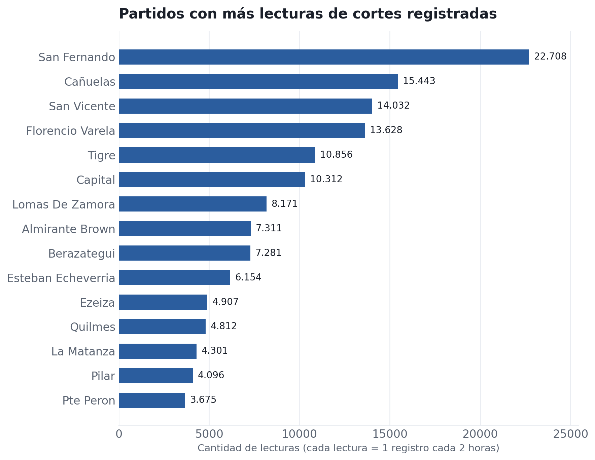
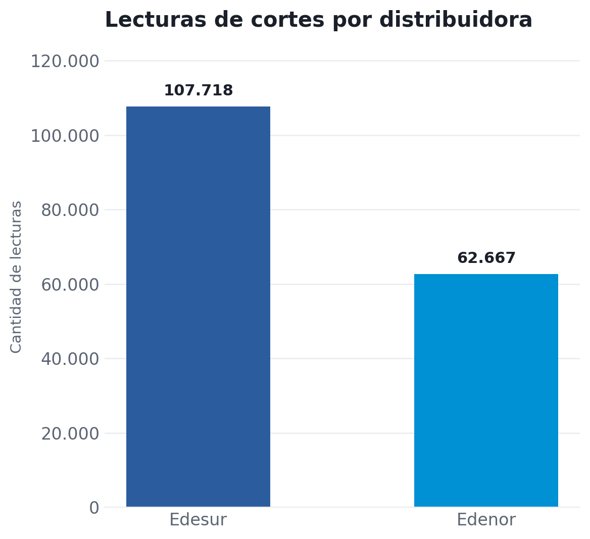
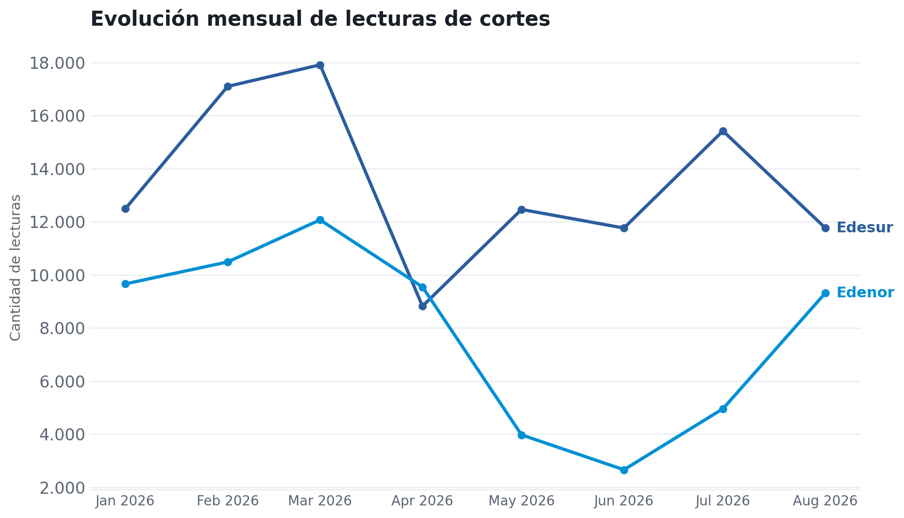

# cortes-enre

Pipeline propio de monitoreo de cortes de energía eléctrica (Edesur y Edenor) en el AMBA, construido sobre datos públicos del [ENRE](https://www.enre.gov.ar/mapaCortes/index.html).

## Qué hace

Un workflow de **GitHub Actions** corre cada 2 horas, scrapea el mapa público de cortes del ENRE y agrega los registros nuevos a un dataset acumulado. No hay intervención manual: la recolección es 100% automatizada y queda documentada en el historial de commits de este repo (`Automated · Latest data: ...`).

- **170.385 lecturas** acumuladas entre el 9 de enero y el 19 de agosto de 2026
- **107.718** corresponden a Edesur, **62.667** a Edenor
- Cada lectura incluye ubicación (lat/lon), partido, localidad, subestación y alimentador afectado, cantidad estimada de afectados, tipo de tensión (media/baja) y hora de normalización estimada cuando el ENRE la informa

## Visualizaciones

**Partidos con más lecturas de cortes registradas**



San Fernando concentra casi el doble de lecturas que el segundo partido en la lista. Antes de leer esto como "más cortes reales", hay que tener en cuenta la limitación de metodología explicada abajo: puede tratarse de menos cortes, pero de mayor duración.

**Lecturas por distribuidora**



Edesur concentra el 63% de las lecturas del período contra el 37% de Edenor — pero ambas empresas cubren zonas geográficas distintas del AMBA, así que esto no es directamente comparable como "índice de calidad de servicio" sin normalizar por cantidad de usuarios de cada distribuidora (dato que este dataset no tiene).

**Evolución mensual de lecturas**



Edesur muestra picos marcados en marzo y julio 2026. Edenor cae fuerte entre abril y junio y se recupera en agosto. El punto de agosto es un mes parcial (datos hasta el 19/8), no un mes completo — no comparar en magnitud absoluta contra los meses anteriores.

## Limitaciones (documentadas explícitamente, no ocultas)

- **Cada fila es una lectura cada 2 horas, no un corte único.** Un corte que dura 10 horas puede aparecer repetido 5 veces en el dataset. Los gráficos de este README cuentan lecturas (observaciones), no eventos reconstruidos — la reconstrucción de eventos (agrupar lecturas consecutivas del mismo alimentador como un solo corte) es un paso de procesamiento adicional que todavía no está en este repo.
- **27,6% de las lecturas** no tienen horario de normalización estimada informado por el ENRE (`Sin Datos`) — no se imputa ni se estima ese valor, se deja tal cual lo entrega la fuente.
- La columna `afectados` va de 0 a 2.243 personas por lectura (mediana: 8) — está sujeta a lo que el ENRE reporta en el momento del scrape, no a un conteo propio verificado.
- El dataset no incluye la cantidad de usuarios por distribuidora, así que ninguna comparación Edesur/Edenor en este README debe leerse como "quién da mejor servicio".

## Stack

Python (`requests`/`pandas` para scraping y procesamiento) · GitHub Actions (automatización cada 2 horas) · CSV como almacenamiento · matplotlib para las visualizaciones de este README

## Estructura del repo

```
scraper.py              # script de scraping del mapa del ENRE
.github/workflows/      # workflow de GitHub Actions (corre cada 2 horas)
cortes_enre.csv         # datos históricos (ene–feb 2026)
cortes_enre2.csv        # datos históricos (feb–actualidad)
```
